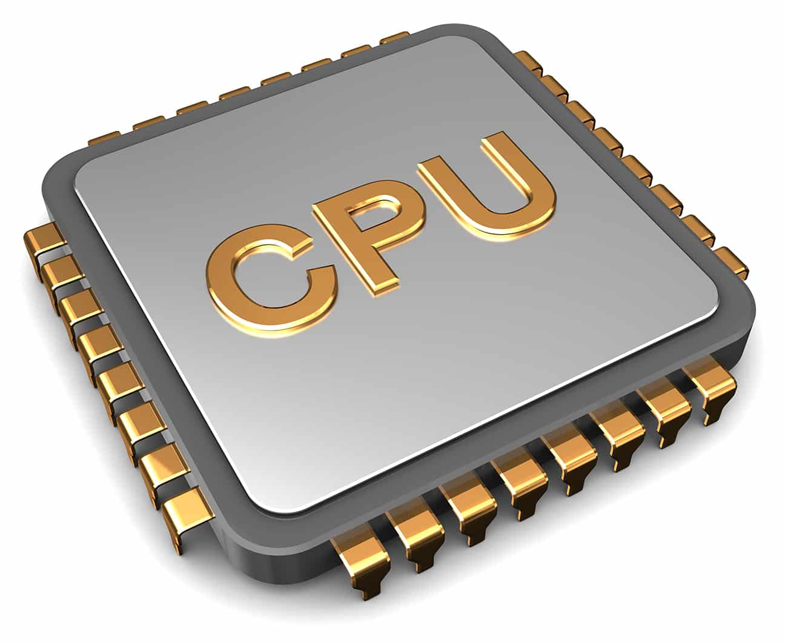
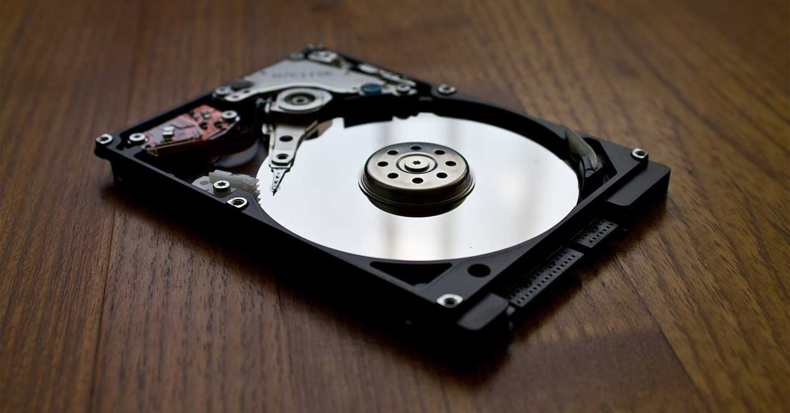
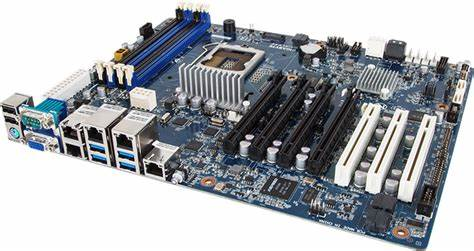
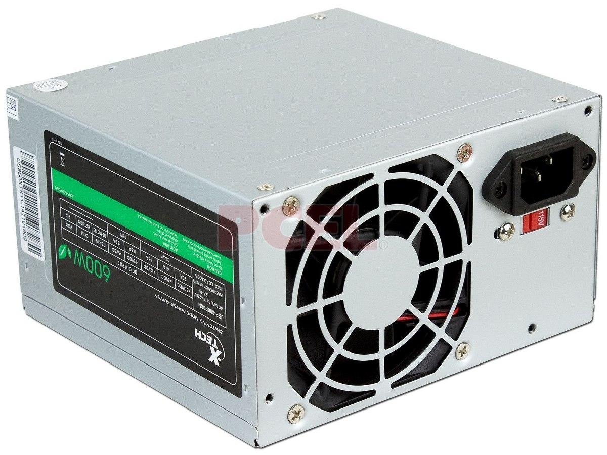
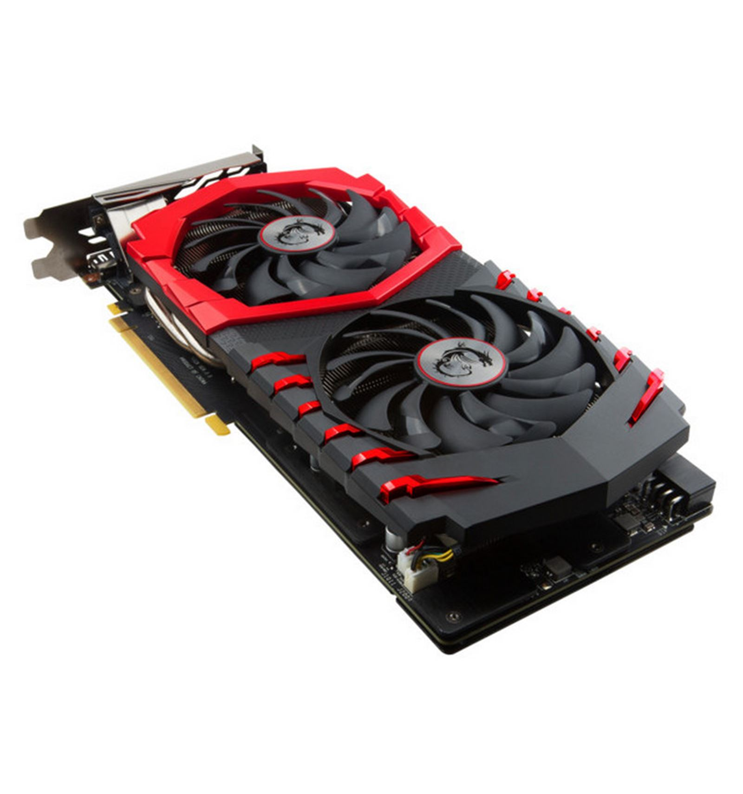
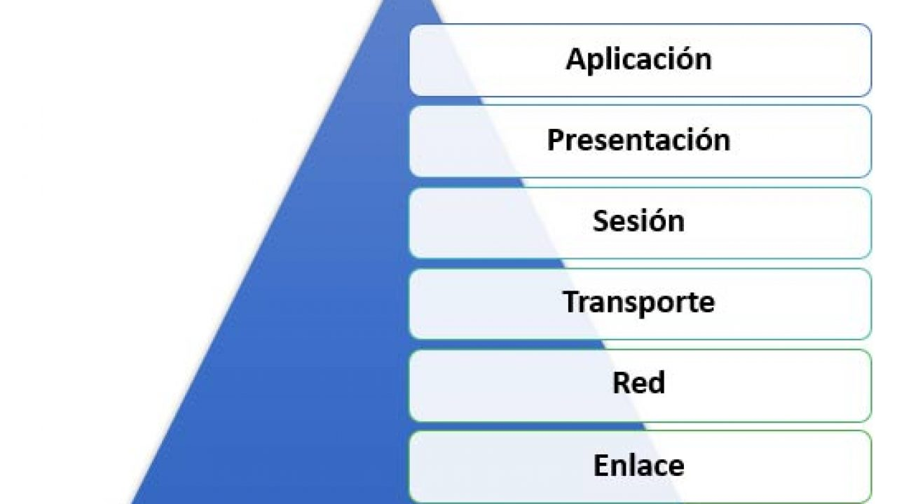

CONCEPTOS BASICOS

Azure: Es un servicio de computación en la nube creado por Microsoft para construir, probar, desplegar y administrar aplicaciones y servicios mediante el uso de sus centros de datos. Proporciona software como servicio (SaaS), plataforma como servicio (PaaS) e infraestructura como servicio (IaaS) y es compatible con muchos lenguajes, herramientas y marcos de programación diferentes, incluidos software y sistemas específicos de Microsoft y de terceros. 

**¿Qué es una computadora?**

una computadora es una máquina capaz de realizar operaciones y cálculos. No es ni más ni menos que una calculadora.

**procesador de una computadora**

El procesador o CPU (Central Processing Unit) es el cerebro de la computadora. Se encarga del intercambio de datos entre los componentes (RAM, disco duro, tarjeta gráfica).

Sus tareas principales son:

<ol>
<li>Leer los datos en la memoria</li>
<li>Procesar los datos</li>
<li>Escribir datos en la memoria</li>

</ol>

<strong>Disco duro</strong>

Su papel es almacenar los datos de la computadora. El disco duro contiene el sistema operativo como Windows, macOS o Linux (entre otros), los programas instalados y los datos personales del usuario.

Almacena información en forma binaria. Actualmente, son capaces de almacenar varios Tera bytes de datos (es decir, 1024 gigabytes), que corresponde a cientos de miles de fotografías, miles de películas, millones de documentos de texto

<ol>
<li>Los discos duros clásicos: contienen piezas mecánicas que incluyen una cabeza de lectura que apunta a los discos magnéticos y lee y escribe los datos.</li>
<li>Los discos duros SSD: sin una parte mecánica, leen los datos más rápidamente.</li>
<li>Los discos duros externos: para tener una copia de seguridad de la computadora y su disco duro interno.</li>

</ol> 

<strong>Placa madre</strong>

Es el componente principal de la unidad central. Centraliza y procesa los datos intercambiados dentro de la computadora usando el procesador. Maneja el disco duro, el teclado, el ratón, la red, los puertos USB...

Es el soporte en el que todos los componentes de una computadora están conectados.

<strong>Fuente de alimentacion</strong>

Por supuesto, sin la corriente eléctrica, la PC no funcionará.

Este bloque transforma y suministra la energía necesaria a la placa base, pero también está conectado a algunos componentes, como el reproductor/grabadora de DVD, por ejemplo.

La transformación de la corriente causa una pérdida de energía en forma de calor, por lo que la computadora cuenta con un sistema de ventilación que expulsa aire a través de la parte posterior de la carcasa de la computadora.

<strong>Tarjeta grafica</strong>

Para los juegos, es importante contar con una buena tarjeta gráfica. Se encarga de la visualización de la pantalla, liberando el procesador de esta función.

También puede ser reemplazada por el chipset integrado directamente en la placa base.

<H> MODELO OSI </H>

  es un modelo de referencia para los protocolos de comunicación de las redes informáticas o redes de computadores.
  Fue creado en la década de 1980 por la Organización Internacional de Normalización (ISO).

<H>¿COMO FUNCIONA EL MODELO OSI?</H>

El funcionamiento del Modelo OSI depende directamente de sus siete capas, en las que descompone el complicado proceso de la comunicación digital. Al compartimentarlo, asigna a cada capa funciones muy específicas, dentro de una estructura jerárquica fija.
 
Así, cada protocolo de comunicación emplea estas capas en su totalidad o sólo algunas de ellas, pero al obedecer este conjunto de reglas, garantiza que la comunicación entre las redes sea eficaz y sobre todo que se de en los mismos términos.

  
<h>CAPAS DEL MODELO OSI</h> 

<ol>
   
 <li>Capa física. La capa más baja del modelo, se encarga de la topología de red y las conexiones globales entre la computadora y la red, refiriéndose tanto al medio físico como a la manera en que la información se transmite. Cumple con las funciones de especificar la información sobre el medio físico (tipos de cable, microondas, etc.), definir la información sobre la tensión eléctrica de la transmisión, las características funcionales de la interfaz de red y garantizar la existencia de una conexión (aunque no la fiabilidad de la misma).
 </li>
   
<li>Capa de enlace de datos. Se ocupa del redireccionamiento físico, detección de errores, acceso al medio y control del flujo durante la comunicación, siendo parte de la creación de protocolos básicos para regular la conexión entre los sistemas informáticos.
</li>
 
<li>Capa de red. Es la capa que se encarga de la identificación del enrutamiento existente entre las redes involucradas, así, las unidades de datos pasan a denominarse “paquetes” y pueden clasificarse conforme al protocolo de enrutamiento o protocolo enrutable que utilizan. Los primeros seleccionan las rutas (RIP, IGRP, EIGRP, entre otras) y los segundos viajan con los paquetes (IP, IPX, APPLETALK, etc.). El objetivo de esta capa es garantizar que los datos lleguen a su destino, incluso si ello implica utilizar dispositivos intermedios, como encaminadores o enrutadores.
</li>
 
<li>Capa de transporte. Aquí es donde se realiza el transporte de los datos que se hallan dentro de cada paquete, de la computadora de origen a la de destino, independientemente del medio físico que se emplee para ello. Su trabajo se da mediante puertos lógicos y da forma a los llamados Sockets IP: Puerto.
</li>
 
<li>Capa de sesión. Se encarga de controlar y mantener el vínculo entre las computadoras que intercambian datos, asegurándose de que, una vez establecida la comunicación entre ambos sistemas, el canal de transmisión de datos pueda retomarse en caso de interrumpirse. Estos servicios pueden llegar a ser prescindibles parcial o totalmente, dependiendo del caso.
</li>
 
<li>Capa de presentación. Esta capa se ocupa de la representación de la información, o sea, de su traducción, garantizando que los datos recibidos en cualquier extremo de la red sean del todo reconocibles, sin importar el tipo de sistema empleado. Es la primera capa que se ocupa del contenido de la transmisión, en vez del modo en que ésta se establece y se sostiene. Además, permite el cifrado y la codificación de los datos, así como su compresión, su adecuación a la máquina que los recibe (una computadora, una tableta, un celular, etc.).
</li>
 
<li>Capa de aplicación. Dado que continuamente se desarrollan nuevos protocolos de comunicación, a medida que surgen nuevas aplicaciones, esta última capa define los protocolos que emplean las aplicaciones para el intercambio de datos y les permite acceder a los servicios de cualquiera de las demás capas. Generalmente, todo este proceso es invisible para el usuario, quien rara vez interactúa con el nivel aplicación, sino con programas que interactúan con el nivel aplicación, haciéndoselo menos complejo de lo que realmente es.
</li>
  

